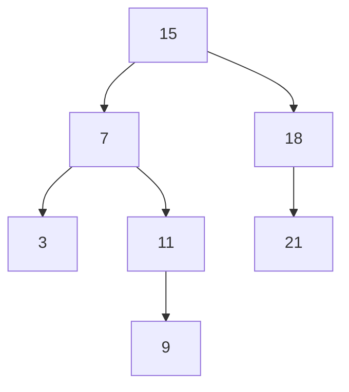

# Parte 2: TAD Diccionario mediante ABB

En esta segunda parte, implementaremos el mismo TAD que en la [parte 1](../parte-1-tad-diccionario-con-t.-hash/), un Diccionario, pero mediante un Árbol Binario de Búsqueda (ABB). Los nodos del árbol almacenaran pares clave→valor. La clave será un tipo `std::string` mientras que el valor será de tipo paramétrico.

Los ABBs son estructuras de datos muy versátiles que facilitan la búsqueda de elementos. Estos árboles son árboles de grado 2 con un criterio de ordenación: para cada nodo **`n`**, todos los elementos del subárbol izquierdo son menores que _**`n`**_ y todos los elementos del subárbol derecho son mayores que _**`n`**_. Un ejemplo de ABB sería:

Al implementar un diccionario mediante un ABB, los nodos almacenarán los pares clave->valor, usando la clave para el criterio de ordenación. Al tratarse de claves alfanuméricas (cadenas de texto), su ordenación se atenderá al criterio de ordenación lexicográfico implementado por defecto en la clase `std::string`.  De todos modos, nuestra implementación del ABB será genérica, por lo que permitirá almacenar cualquier tipo de dato predefinido (`int`, `string`, ...) o tipos definidos por el usuario.
