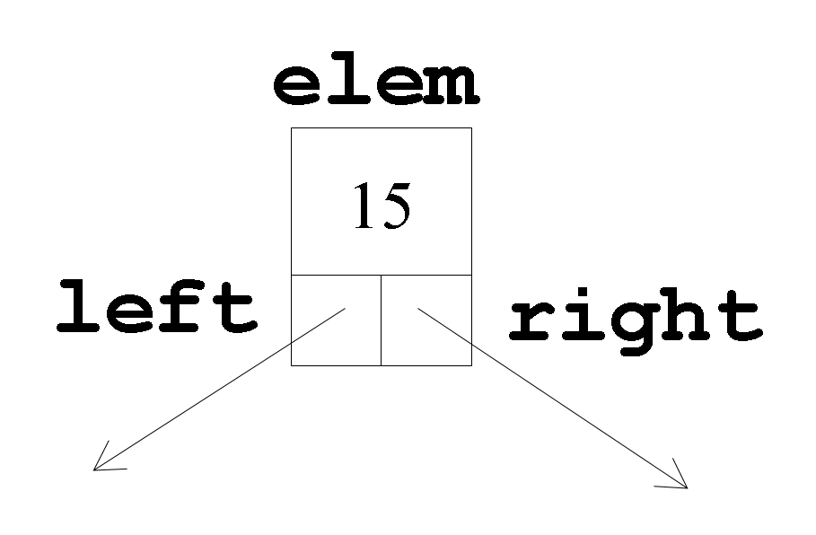

# Clase BSNode\<T>

La representación de los nodos de un Árbol Binario de Búsqueda es una estructura ternaria en la que se guarda el elemento y dos punteros, uno al sucesor (sub-árbol) izquierdo y otro al derecho. Esta estructura se implementará en una clase genérica denominada `BSNode<T>` _(Binary Search Node)_.

<figure><figcaption></figcaption></figure>

## Atributos

<table><thead><tr><th width="149">Visibilidad</th><th width="206">Atributo</th><th>Descripción</th></tr></thead><tbody><tr><td><code>public</code></td><td><code>T elem</code></td><td>El elemento de tipo T almacenado en el nodo.</td></tr><tr><td><code>public</code></td><td><code>BSNode&#x3C;T>* left</code></td><td>Puntero al nodo sucesor izquierdo.</td></tr><tr><td><code>public</code></td><td><code>BSNode&#x3C;T>* right</code></td><td>Puntero al nodo sucesor derecho.</td></tr></tbody></table>

## Métodos

<table><thead><tr><th width="131.99609375">Visibilidad</th><th width="295">Método</th><th>Descripción</th></tr></thead><tbody><tr><td><code>public</code></td><td><code>BSNode(T elem, BSNode&#x3C;T>* left=nullptr, BSNode&#x3C;T>* right=nullptr)</code></td><td>Método constructor que crea un BSNode con el elemento <code>elem</code> y los punteros a los nodos sucesores <code>left</code> y  <code>right</code> proporcionados (nulos por defecto). </td></tr><tr><td><code>public</code></td><td><code>friend std::ostream&#x26; operator&#x3C;&#x3C;(std::ostream &#x26;out, const BSNode&#x3C;T> &#x26;bsn)</code></td><td>Sobrecarga global del operador <code>&#x3C;&#x3C;</code> para imprimir el nodo por pantalla. Por simplicidad, puedes limitarte a imprimir el atributo <code>elem</code>. Recuerda incluir la cabecera <code>&#x3C;ostream></code> en el <code>.h</code>.</td></tr></tbody></table>

## Declaración e implementación de la clase BSNode\<T>


**La definición e implementación de clases genéricas/templatizadas se debe realizar en un único fichero de cabeceras (.h)**, para que el compilador pueda generar código específico derivado de los _templates_ (más info [aquí](https://isocpp.org/wiki/faq/templates#templates-defn-vs-decl)).


Desde nuestro directorio de trabajo (raíz del repositorio git), abre Vim para crear el fichero `BSNode.h` que contendrá tanto la definición como la implementación de la clase `BSNode<T>`.

```bash
vim BSNode.h
```

Escribe en él la declaración de la clase genérica `BSNode<T>`, de acuerdo con la especificación del apartado anterior. A continuación tienes una "inicialización" o plantilla de dicho fichero, por si te sirve de ayuda para empezar:

```cpp
#ifndef BSNODE_H
#define BSNODE_H

#include <ostream>

template <typename T> 
class BSNode {
    public:
        // miembros públicos
    
};

#endif
```

Guarda el fichero y, sin salir de vim, ejecuta el compilador g++ para depurar tu implementación:

```bash
:!g++ -c BSNode.h  # Recuerda ejecutarlo desde el modo comando de vim!
```

Comprueba la salida del compilador, y depura tu implementación en caso necesario.  A continuación, añade el fichero al área de preparación de git:

```bash
git add BSNode.h
```

y confirma los cambios con un mensaje informativo:

```bash
git commit -m "Añadida implementación de la clase BSNode"
```

Si lo crees conveniente, haz `git push` para enviar los cambios a tu repositorio remoto en GitHub.&#x20;
