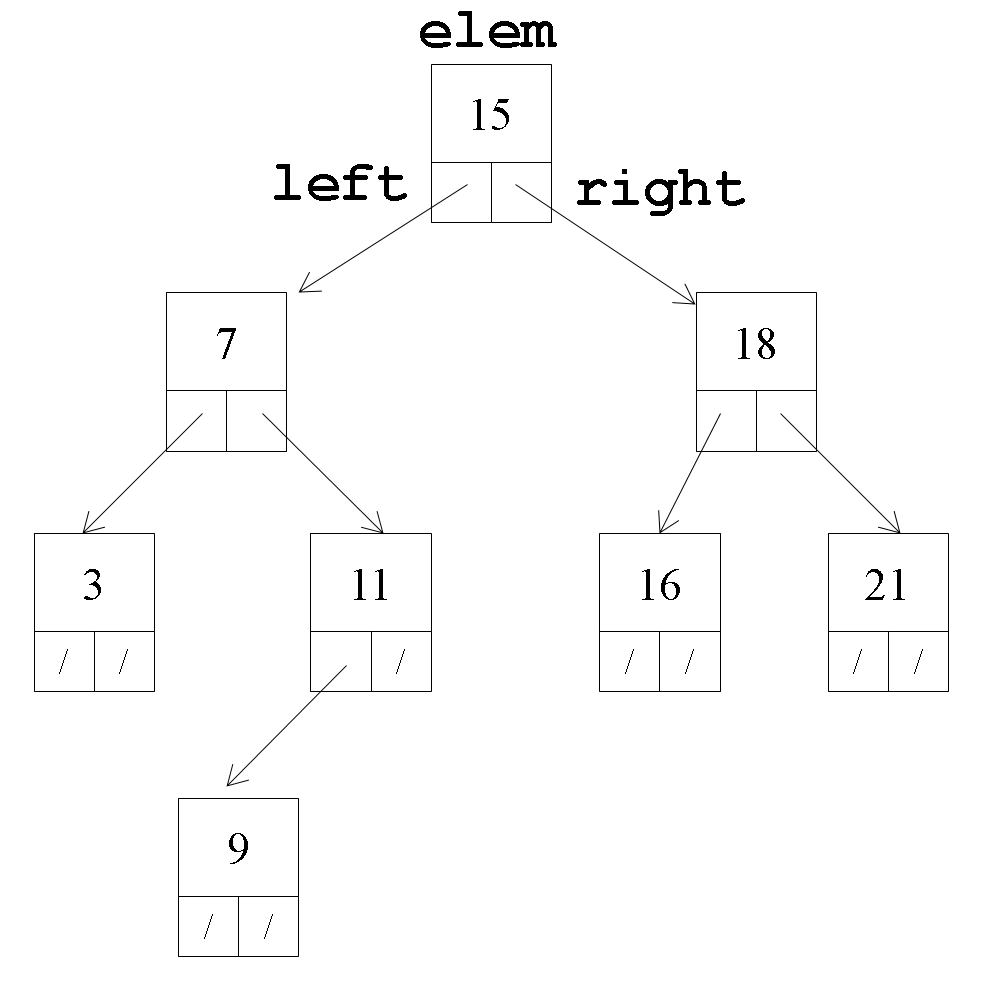

# Clase BSTree\<T>

Representaremos un ABB mediante la clase genérica **`BSTree<T>`** _(Binary Search Tree)_. Esta almacenará un puntero al nodo raíz del árbol, de tipo [**`BSNode<T>`**](clase-bsnode-less-than-t-greater-than.md), así como un contador del número de elementos almacenados en el árbol.

<figure><figcaption></figcaption></figure>

Además, ofrecerá las operaciones básicas de un árbol (insertar, buscar y eliminar) vistas en teoría, más un conjunto de funciones auxiliares necesarias. &#x20;

La implementación deberá ocultar la estructura interna del árbol, y en particular, el tipo de datos **`BSNode<T>`**. Esto es, el usuario de **`BSTree<T>`** no debe tener acceso en ningún momento a los nodos del árbol.&#x20;

## Atributos

<table><thead><tr><th width="149">Visibilidad</th><th width="190">Atributo</th><th>Descripción</th></tr></thead><tbody><tr><td><code>private</code></td><td><code>int nelem</code></td><td>Número de elementos almacenados en el ABB. </td></tr><tr><td><code>private</code></td><td><code>BSNode&#x3C;T> *root</code></td><td>Nodo raíz del ABB.</td></tr></tbody></table>

## Métodos

A continuación se describen los métodos públicos y privados que implementan las operaciones de recorrido, búsqueda, inserción, eliminación, y liberación de memoria. Los métodos públicos, en general, son funciones lanzadera que invocan las funciones recursivas correspondientes sobre el nodo raíz `root`.


Se recomienda implementar los métodos en el orden que aparecen a continuación.


### Creación y tamaño

<table><thead><tr><th width="127">Visibilidad</th><th width="325">Método</th><th>Descripción</th></tr></thead><tbody><tr><td><code>public</code></td><td><code>BSTree()</code></td><td>Método constructor. Crea un ABB vacío.</td></tr><tr><td><code>public</code></td><td><code>int size() const</code></td><td>Devuelve el número de elementos <code>nelem</code> del ABB.</td></tr></tbody></table>

### Búsqueda de elementos

<table><thead><tr><th width="127">Visibilidad</th><th width="325">Método</th><th>Descripción</th></tr></thead><tbody><tr><td><code>public</code></td><td><code>T search(T e) const</code></td><td>Busca y devuelve el elemento  <code>e</code> de tipo <code>T</code> en el ABB.  Actúa como <strong>método lanzadera</strong> del método privado recursivo <code>search(BSNode&#x3C;T>* n, T e)</code>.  Notar que deberá devolver el elemento contenido por el nodo devuelto por el método privado.</td></tr><tr><td><code>private</code></td><td><p><code>BSNode&#x3C;T>* search(</code></p><p>  <code>BSNode&#x3C;T>* n,</code> </p><p>  <code>T e) const</code></p></td><td><p>Método recursivo para la búsqueda elementos en el ABB. Busca y devuelve el elemento <code>e</code> de tipo <code>T</code> si se encuentra en el (sub-)árbol cuya raíz es <code>n</code>, de lo contrario lanza una <code>std::runtime_error</code>. </p><p><strong>Ver pseudocódigo abajo</strong>. </p></td></tr><tr><td><code>public</code></td><td><code>T operator[](T e) const</code></td><td>Sobrecarga del operador<code>[]</code>. Actúa como interfaz al método <code>search(T e)</code>.</td></tr></tbody></table>


A modo de referencia, se muestra el pseudocódigo de búsqueda visto en teoría:

<details>

<summary>Pseudocódigo búsqueda</summary>

```clike
function search(e): // función lanzadera 
    return search(r, e).elem // r -> nodo raíz

function search(n, e):
    if n == null then
        raise new ElementNotFoundException()
    else if n.elem < e then
        return search(n.der, e)
    else if n.elem > e then
        return search(n.izq, e)
    else
        return n
    end
```

</details>


### Inserción de elementos

<table><thead><tr><th width="127">Visibilidad</th><th width="325">Método</th><th>Descripción</th></tr></thead><tbody><tr><td><code>public</code></td><td><code>void insert(T e)</code></td><td>Inserta el elemento <code>e</code> de tipo <code>T</code> de manera ordenada en el  ABB. Actúa como <strong>método lanzadera</strong> del método privado recursivo <code>insert(BSNode&#x3C;T>* n, T e)</code>.</td></tr><tr><td><code>private</code></td><td><p><code>BSNode&#x3C;T>* insert(</code></p><p>  <code>BSNode&#x3C;T>* n,</code> </p><p>  <code>T e)</code></p></td><td><p>Método recursivo para la inserción ordenada de elementos. Inserta el elemento <code>e</code> de tipo <code>T</code> de manera ordenada en el (sub-)árbol cuya raíz es <code>n</code>. Devuelve el nodo que encabeza dicho (sub-)árbol modificado. Si el elemento <code>e</code> ya existe, lanza un <code>std::runtime_error</code>. </p><p><strong>Ver pseudocódigo abajo</strong>. </p></td></tr></tbody></table>


A modo de referencia, se proporciona el pseudocódigo de inserción visto en teoría:

<details>

<summary>Pseudocódigo inserción</summary>

```clike
function insert(e): // función lanzadera 
    r = insert(r, e) // r -> nodo raíz

function insert(n, e):
    if n == null then
        return new Node(e);
    else if n.elem == e then
        raise new DuplicatedElementException();
    else if n.elem < e then
        n.der = insert(n.der, e);
    else
        n.izq = insert(n.izq, e);
    return n;
```

</details>


### Recorrido e impresión del árbol

<table><thead><tr><th width="127">Visibilidad</th><th width="325">Método</th><th>Descripción</th></tr></thead><tbody><tr><td><code>public</code></td><td><p><code>friend std::ostream&#x26; operator&#x3C;&#x3C;(</code></p><p>  <code>std::ostream &#x26;out,</code> </p><p>  <code>const BSTree&#x3C;T> &#x26;bst)</code></p></td><td>Sobrecarga del operador <code>&#x3C;&#x3C;</code> para mostrar a través de <code>out</code> los contenidos del ABB <code>bst</code>, realizando un recorrido <em>inorden</em> o simétrico del árbol para mostrar los elementos ordenados de menor a mayor. Delega en el método privado recursivo <code>print_inorder()</code>. </td></tr><tr><td><code>private</code></td><td><p><code>void print_inorder(</code></p><p>  <code>std::ostream &#x26;out,</code> </p><p>  <code>BSNode&#x3C;T>* n) const</code></p></td><td><p>Recorrido <em>inorden</em> o simétrico del (sub-)árbol cuya raíz es <code>n</code> para mostrar a través de <code>out</code> los elementos ordenados de menor a mayor. </p><p><strong>Ver pseudocódigo abajo</strong>. </p></td></tr></tbody></table>


A modo de referencia, se proporciona el pseudocódigo de recorrido _inorden_ visto en teoría:

<details>

<summary>Pseudocódigo recorrido <em>inorden</em></summary>

```clike
function inorden(n, P):
    if n != null then
        inorden(n.first_descendant(), P)
        P(n)
        foreach d in sorted(n.remaining_descendants()) do
            inorden(d, P)
        done
    end
```

</details>


### Eliminación de elementos

<table><thead><tr><th width="127">Visibilidad</th><th width="330">Método</th><th>Descripción</th></tr></thead><tbody><tr><td><code>public</code></td><td><code>void remove(T e)</code></td><td>Elimina el elemento e de tipo T del ABB. Actúa como <strong>método lanzadera</strong> del método privado recursivo <code>remove(BSNode&#x3C;T>* n, T e)</code>.</td></tr><tr><td><code>private</code></td><td><p><code>BSNode&#x3C;T>* remove(</code></p><p>  <code>BSNode&#x3C;T>* n,</code> </p><p>  <code>T e)</code></p></td><td><p>Método recursivo para la eliminación de elementos. Elimina el elemento <code>e</code> del (sub-)árbol cuya raíz es <code>n</code>. Devuelve el nodo que encabeza dicho (sub-)árbol modificado. En caso de eliminar un nodo con dos sucesores (izquierdo y derecho), aplicará la política de reemplazo por el <strong>elemento máximo del subárbol izquierdo</strong>. Para ello, se apoyará en los métodos privados auxiliares <code>max()</code> y <code>remove_max()</code>. Si el elemento <code>e</code> no existe, lanza un <code>std::runtime_error</code>. </p><p><strong>Ver pseudocódigo abajo</strong>. </p></td></tr><tr><td><code>private</code></td><td><code>T max(BSNode&#x3C;T>* n) const</code></td><td>Método recursivo que devuelve el elemento de máximo valor contenido en el (sub-)árbol cuya raíz es <code>n</code>. </td></tr><tr><td><code>private</code></td><td><code>BSNode&#x3C;T>* remove_max(BSNode&#x3C;T>* n)</code></td><td>Método recursivo que elimina el elemento de máximo valor contenido en el (sub-)árbol cuya raíz es <code>n</code>. </td></tr></tbody></table>


A modo de referencia, se proporciona el pseudocódigo de eliminación visto en teoría:

<details>

<summary>Pseudocódigo eliminación</summary>

```clike
function remove(e): // función lanzadera 
    root = remove(r, e) // r -> nodo raíz

function remove(n, e):
    if n == null then
        raise new ElementNotFoundException()
    else if n.elem < e then
        n.der = remove(n.der, e)
    else if n.elem > e then
        n.izq = remove(n.izq, e) 
    else
        if n.izq != null and n.der != null then // 2 desc.
            n.elem = max(n.izq)
            n.izq = remove_max(n.izq)
        else // 1 ó 0 descendientes
            n = (n.izq != null)? n.izq: n.der
        end
    end
    return n

function max(n):
    if n == null then
        raise new ElementNotFoundExcep()
    else if n.der != null then
        return max(n.der)
    else
        return n.elem
    end

function remove_max(n):
    if n.der == null then
        return n.izq
    else
        n.der = remove_max(n.der)
        return n
    end
```

</details>


### Destrucción

<table><thead><tr><th width="127">Visibilidad</th><th width="325">Método</th><th>Descripción</th></tr></thead><tbody><tr><td><code>public</code></td><td><code>~BSTree()</code></td><td>Método destructor. Delega en el método privado recursivo <code>delete_cascade()</code>.</td></tr><tr><td><code>private</code></td><td><code>void delete_cascade(BSNode&#x3C;T>* n)</code></td><td>Método recursivo para liberación de la memoria dinámica ocupada por los objetos de tipo <code>BSNode&#x3C;T></code> que conforman el (sub-)árbol cuya raíz es <code>n</code>.</td></tr></tbody></table>

## Declaración e implementación de la clase BSTree\<T>


**La definición e implementación de clases genéricas/templatizadas se debe realizar en un único fichero de cabeceras (.h)**, para que el compilador pueda generar código específico derivado de los _templates_ (más info [aquí](https://isocpp.org/wiki/faq/templates#templates-defn-vs-decl)).


Desde nuestro directorio de trabajo (raíz del repositorio git), abre Vim para crear el fichero `BSTree.h` que contendrá tanto la definición como la implementación de la clase `BSTree<T>`.

```bash
vim BSTree.h
```

Escribe en él la declaración de la clase genérica `BSTree<T>`, de acuerdo con la especificación del apartado anterior. A continuación tienes una "inicialización" o plantilla de dicho fichero, por si te sirve de ayuda para empezar:

```cpp
#ifndef BSTREE_H
#define BSTREE_H

#include <ostream>
#include <stdexcept>
#include "BSNode.h"

template <typename T> 
class BSTree {
    private:
        //miembros privados
    public:
        // miembros públicos
    
};

#endif
```

Guarda el fichero y, sin salir de vim, ejecuta el compilador g++ para depurar tu implementación:

```bash
:!g++ -c BSTree.h  # Recuerda ejecutarlo desde el modo comando de vim!
```

Comprueba la salida del compilador. En casos de existir errores (seria lo más normal), examínalos con calma y detenimiento, y pulsa `ENTER` para volver al buffer de Vim para empezar a corregirlos. Repite este proceso, tantas veces como sea necesario, hasta que hayas depurado tu solución.&#x20;

&#x20;A continuación, añade el fichero al área de preparación de git:

```bash
git add BSTree.h
```

y confirma los cambios con un mensaje informativo:

```bash
git commit -m "Añadida implementación de la clase BSTree"
```

## Depuración de la clase BSTree\<T>

&#x20;Guarda en nuestro directorio de trabajo el siguiente fichero para test:



Examina su contenido. Verás que realiza una serie de operaciones en un Árbol Binario de búsqueda con valores enteros (el tipo `int` es paramétrico), a fin de testear las diferentes operaciones que nos brinda esta implementación.&#x20;

A continuación, procederemos a añadir al fichero `Makefile` una regla para generar el objetivo `bin/testBSTree` (binario ejecutable). Este dependerá de los ficheros `BSTree.h`, `BSNode.h` y `testBSTree.cpp`. &#x20;

```bash
vim Makefile
```

&#x20;Una vez implementada la regla, ejecútala:

```bash
make bin/testBSTree
```

Finalmente, ejecuta el programa de test, para comprobar que tu implementación es correcta. Estando en el directorio raíz del proyecto:

```bash
./bin/testBSTree
```

&#x20;Esto debería generar una salida parecida a esta:

<details>

<summary>Salida esperada del programa de test "testBSTree"</summary>

```
Creating BSTree<int> bstree ...

bstree.size(): 0
cout << bstree: 

bstree.insert(15)
-----------------
bstree.size(): 1
bstree.search(15): 15
cout << bstree: 
15 

bstree.insert(7)
----------------
bstree.size(): 2
bstree.search(7): 7
cout << bstree: 
7 15 

bstree.insert(3)
----------------
bstree.size(): 3
bstree.search(3): 3
cout << bstree: 
3 7 15 

bstree.insert(11)
-----------------
bstree.size(): 4
bstree.search(11): 11
cout << bstree: 
3 7 11 15 

bstree.insert(9)
----------------
bstree.size(): 5
bstree.search(9): 9
cout << bstree: 
3 7 9 11 15 

bstree.insert(18)
-----------------
bstree.size(): 6
bstree.search(18): 18
cout << bstree: 
3 7 9 11 15 18 

bstree.insert(21)
-----------------
bstree.size(): 7
bstree.search(21): 21
cout << bstree: 
3 7 9 11 15 18 21 

bstree.insert(20)
-----------------
bstree.size(): 8
bstree.search(20): 20
cout << bstree: 
3 7 9 11 15 18 20 21 

bstree.search(0) => OK! It throwed std::runtime_error: Element not found!
bstree.search(9) => OK! It did not throw std::runtime_error.
bstree.insert(9) => OK! It throwed std::runtime_error: Duplicated element!
bstree.remove(50) => OK! It throwed std::runtime_error: Element not found!

bstree.remove(9)
----------------
bstree.size(): 7
cout << bstree: 
3 7 11 15 18 20 21 

bstree.insert(9)
----------------
bstree.size(): 8
cout << bstree: 
3 7 9 11 15 18 20 21 

bstree.remove(11)
-----------------
bstree.size(): 7
cout << bstree: 
3 7 9 15 18 20 21 

bstree.insert(11)
-----------------
bstree.size(): 8
cout << bstree: 
3 7 9 11 15 18 20 21 

bstree.remove(7)
----------------
bstree.size(): 7
cout << bstree: 
3 9 11 15 18 20 21 

bstree.insert(7)
----------------
bstree.size(): 8
cout << bstree: 
3 7 9 11 15 18 20 21 

bstree.remove(15)
-----------------
bstree.size(): 7
cout << bstree: 
3 7 9 11 18 20 21 

bstree.insert(15)
-----------------
bstree.size(): 8
cout << bstree: 
3 7 9 11 15 18 20 21 

```

</details>

&#x20;Si tu salida es diferente, revisa tu código.&#x20;


Si la ejecución del programa se queda "colgada", seguramente sea porque ha entrado en un bucle infinito. Pulsa `CTRL+C` para "matar" el proceso, y revisa los bucles de tu código.&#x20;


Añade `testBSTree.cpp` y `Makefile` a git (y `BSTree.h` también, si has hecho cambios):

```bash
git add testBSTree.cpp Makefile BSTree.h
```

y confirma los cambios con un mensaje informativo:

```bash
git commit -m "Añadido Makefile y código de test de la clase BSTree"
```

Este parece ser un buen momento para sincronizar tu repositorio local con tu repositorio remoto de GitHub, para enviarle todos los cambios (_commits_) realizados localmente:

```bash
git push
```
